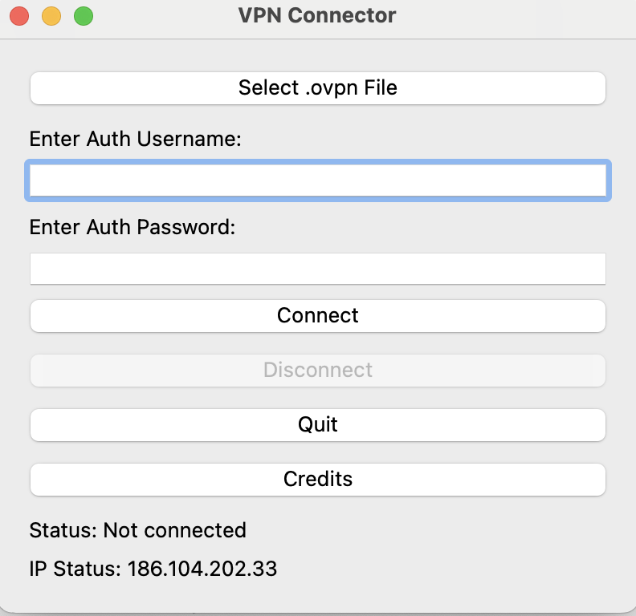
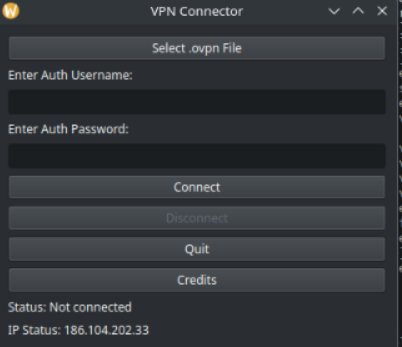

# OpenVPN-GUI-Connect (ovpnconn)*
Streamlined graphical interface for connecting to VPNs using OpenVPN, with file selection and credential entry features.

This Python application provides a user-friendly graphical interface (GUI) to manage OpenVPN connections on a Linux system. The application is built using PyQt5, a set of Python bindings for the Qt application framework, which allows for the creation of a modern and responsive user interface. The primary purpose of the application is to simplify the process of connecting to and disconnecting from VPNs, particularly for users who might find command-line tools cumbersome or complex.

<sub>* This is currently an experimental phase where the primary focus is on making the system functional and establishing a practical and logical pathway that aligns with both my vision and the project's goals. It might contain errors, bugs, etc. Many other non-core elements of the project are considered secondary.</sub>


[](https://github.com/Naereen/badges/)


[](https://opensource.org/licenses/BSD-3-Clause)

<!--
[](http://perso.crans.org/besson/LICENSE.html)
-->

[](https://www.vim.org/)
[](https://code.visualstudio.com/)


# 

#### Key Features:
#### VPN File Selection:

Users can easily select an .ovpn configuration file by clicking the "Select .ovpn File" button. This file is crucial as it contains all the necessary configuration details required by OpenVPN to establish a connection, such as the server address, port, protocol, and encryption settings.
Credential Management:

The application provides fields for the user to input their VPN credentials, namely the username and password. These credentials are securely handled, being written temporarily to a file (/tmp/vpn_auth.txt) for use by OpenVPN during the connection process. This temporary file is only created when initiating a connection and is used to authenticate with the VPN server.
Connection Handling:

Upon pressing the "Connect" button, the application triggers the VPN connection process using pkexec to execute OpenVPN with elevated privileges. The connection status is monitored in real-time, and the user is immediately informed of the connection progress through status messages displayed in the GUI. For example, after starting the connection process, the status will first show "Connecting...", and upon successful connection, it updates to "Connected successfully."
The connection process runs in a separate thread to ensure that the GUI remains responsive and doesn't freeze while the VPN connection is being established.
Disconnection:

- Disconnecting from the VPN is straightforward. By clicking the "Disconnect" button, the application sends a command using sudo pkill openvpn, which forcefully terminates any running OpenVPN processes. Upon successful disconnection, the status is updated to "Successfully disconnected from VPN," and the user is able to reconnect using a different configuration if desired.
IP Address Display:

- The application automatically fetches and displays the user's current public IP address upon startup and after any connection or disconnection event. This feature helps users verify whether they are connected to the VPN or not, as the IP address shown will change depending on whether the VPN is active.
Credits and About Information:

- There is a "Credits" button in the interface that, when clicked, displays a pop-up window with information about the developer, including contact details, the project’s GitHub repository, and licensing information.
GUI Layout and Usability:

- The interface is designed with simplicity and ease of use in mind. The layout consists of clear and logically arranged buttons and labels that guide the user through the process of connecting and disconnecting from a VPN. The status messages provide real-time feedback, ensuring that users are always informed about what is happening.
The interface also includes a "Quit" button that gracefully closes the application. If a VPN connection is active, the application will attempt to disconnect before exiting.
Error Handling:

- The application includes basic error handling to manage common issues, such as missing credentials or failed connections. These errors are reported back to the user through the status label, ensuring transparency and guiding the user in troubleshooting potential problems.
Security Considerations:

Since the application uses pkexec to execute commands with elevated privileges, it requires the user to authenticate with their system password. This ensures that only authorized users can connect or disconnect from VPNs, adding an extra layer of security.
Additionally, the temporary credentials file is kept in a secure location (/tmp) and is managed so that it is only accessible during the connection process. This reduces the risk of unauthorized access to sensitive information.

#### Use Cases:
- Privacy-Conscious Users: This application is ideal for users who value their privacy and regularly use VPNs to protect their online activities. It simplifies the VPN connection process and provides immediate feedback, making it easier to ensure that their connection is secure.
- Remote Workers: For professionals who rely on VPNs to access work resources, this tool provides a quick and reliable way to connect to their company's VPN, reducing downtime and improving productivity.
- Linux Enthusiasts: Users who prefer using Linux but want a more straightforward way to manage their VPN connections can benefit from this GUI application, which abstracts the complexity of command-line tools while retaining full functionality.

#### Installation and Dependencies:
To run this application, you need to have Python 3 installed on your system, along with the PyQt5 library. Additionally, openvpn, curl, and pkexec must be installed and configured on your system to allow the application to manage VPN connections.

Dependencies:

Python 3
PyQt5
OpenVPN
curl
pkexec (part of the polkit package)

#

#### Screenshots

[](#)

#### Screenshots

<p align="center">
  
</p>

<p align="center">
  
</p>


#

#### Installation
#### Via AUR using YAY

[](#)

[](https://aur.archlinux.org/packages/ovpnconn)

<!-- 
[](https://aur.archlinux.org/packages/ovpnconn)
-->

https://aur.archlinux.org/packages/ovpnconn

OpenVPN GUI Connect is available on AUR (Arch User Repository), and it can be installed using the `yay` package manager. Follow the steps below to install OpenVPN GUI Connect:

1. Make sure you have `yay` installed. If not, you can install it with the following command:
   
   ```
   sudo pacman -S yay
   ```
   
   Once yay is installed, you can install by running the following command:
   
   ```
   yay -S ovpnconn
   ```

This command will automatically fetch the package from AUR and handle the installation process for you.
You can find OpenVPN GUI Connect in your program menu!


#

#### Bash Installer 🚀 for Linux (Arch and Debian) - macOS*

[](#)

#### To Install it: 

To install OpenVPN GUI Connect, simply run the installer script available [here](https://github.com/felipealfonsog/OpenVPN-GUI-Connect/raw/main/installer.sh).

Or just Copy - Paste in your terminal and use -curl- to start downloading the installer:

   ```
   curl -O https://raw.githubusercontent.com/felipealfonsog/OpenVPN-GUI-Connect/main/installer.sh
   ```

If you want to use -wget- just copy/paste this line:

   ```
   wget https://github.com/felipealfonsog/OpenVPN-GUI-Connect/raw/main/installer.sh
   ```

   On macOS to download - wget - just install it with Homebrew:

   ```
   brew install wget
   ```

#### Important note when installing:

If you encounter issues executing the file in the terminal, like this message "-bash: ./installer.sh: Permission denied", follow these simple steps to fix it:

1. Open your terminal.
2. Navigate to the directory where the installer script is located using the `cd` command.
3. Run the following command to grant execute permission to the installer script:

   ```
   chmod +x installer.sh
   ```
   
4. Now you can run the installer without any problems.

   ```
   ./installer.sh
   ```
   NOTE: The script will ask for -sudo permissions-. Just simply type in macOS your macOS user password, and in Linux your -sudo- password.

Now type 'ovpnconn' in the terminal and enjoy! 😊🚀

***If you're using Arch Linux, you can find it in your program menu!.***

Feel free to reach out if you need any further assistance!

#### Updating with the script: 

If you want to update NovaNav (novanav) in your system, re-run the script:

   ```
   ./installer.sh
   ```
Please note that if you encounter any issues or have suggestions, feel free to raise an issue on the [OpenVPN-GUI-Connect repository](https://github.com/felipealfonsog/OpenVPN-GUI-Connect/issues). Your feedback is invaluable!

Thank you for joining me on this journey, and I hope it brings value to your life and workflow. Let's continue making technology accessible and enjoyable for everyone!

<sub>* on macOS version might contain some errors, bugs, etc.</sub>

#


#### 🌟 Contact the Creator and Engineer Behind This Project


👨‍💻 **Felipe Alfonso González**  
📧 Email: [f.alfonso@res-ear.ch](mailto:f.alfonso@res-ear.ch)  
🐦 x (Twitter): [@felipealfonsog](https://twitter.com/felipealfonsog)  
🔗 GitHub: [felipealfonsog](https://github.com/felipealfonsog)  
📄 License: BSD 3-Clause  


#

#### 🤝 Support and Contributions

If you find this project helpful and would like to support its development, there are several ways you can contribute:

- **Code Contributions**: If you're a developer, you can contribute by submitting pull requests with bug fixes, new features, or improvements. Feel free to fork the project (development branch) and create your own branch to work on.
- **Bug Reports and Feedback**: If you encounter any issues or have suggestions for improvement, please open an issue on the project's GitHub repository. Your feedback is valuable in making the project better.
- **Documentation**: Improving the documentation is always appreciated. If you find any gaps or have suggestions to enhance the project's documentation, please let me know.

[](https://www.buymeacoffee.com/felipealfonsog)
[](https://www.paypal.me/felipealfonsog)
[](https://github.com/sponsors/felipealfonsog)

Your support and contributions are greatly appreciated! Thank you for your help in making this project better. If you need to mail me, this is the way: f.alfonso@res-ear.ch (I'm Felipe, the Computer Science Engineer behind this idea. Cheers!)


#### 📄 License

This project is licensed under the [BSD 3-Clause License](LICENSE). It will have some restrictions, ask about it.
